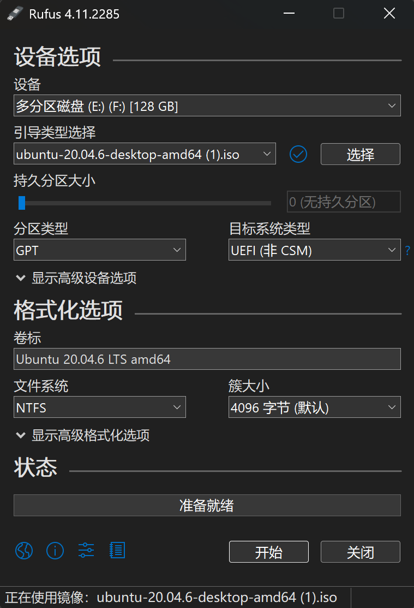
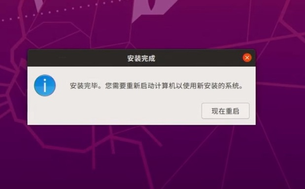
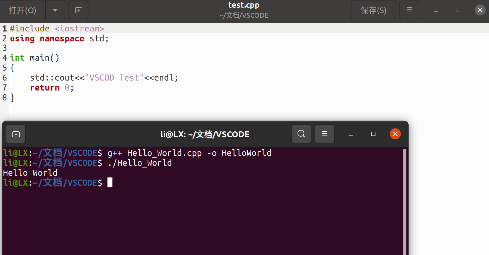

# Week1 实验报告

## **一. 实验任务**
### 1. 安装双系统
- Ubuntu 20.04 + Windows双系统安装与启动
### 2. VSCode安装与配置
- VSCode 编程，安装C++环境
### 3. Git基础操作
- init/add/commit/push
### 4. 编写Markdown实验报告
  
----
## 二. 实现过程
### 1. 安装双系统
#### 1）Ubuntu20.04官网下载
[Ubuntu官网](https://unbuntu.com/download/desktop)
#### 2）制作Ubuntu启动盘
- **Win32 DiskImager**
 “映像文件”选择前面下载的Ubuntu20.04 
 “设备”选择U盘的盘符，写入。
 这里在制作启动盘时遇到了几个问题[遇到问题1](#1制作ubuntu启动盘时)

 - **rufs**(我最后选用rufus来进行Ubuntu启动盘的制作)

    - 下载并安装Rufus
    - 选择U盘和Ubuntu ISO文件
    - 分区选择GPT，文件系统选NTFS
    - 点击“开始”按钮，等待写入完成
    - 完成后，重启电脑并选择从U盘启动
  
### 3）安装Ubuntu系统
**1.查看电脑磁盘分区类型** ：在磁盘管理，属性里面选择卷栏，磁盘分区形式可以看到自己的分区类型（我的电脑是GPT）
**2.预留空闲磁盘空间** ： 在磁盘管理，从D盘压缩空间留给Ubuntu，鼠标右键点击D盘空间选择压缩卷，修改压缩空间量为40000MB，点击压缩，然后D盘后面多出差不多40GB的可用空间。
**3.借助Ubuntu启动盘安装Ubuntu系统** ：
- 重启电脑进入**BIOS**界面，确认UEFI模式，关闭安全启动（Secure Boot按钮，将启动设置里面的启动顺序调整为USB-HDD-PXE,然后按F10保存修改退出，选择第一个install Ubuntu，enter进入。
- 进入**Ubuntu安装界面**，选择中文以及“安装Ubuntu”选项，键盘布局选择chinese，无线网先不连接，“更新和其他软件”界面选择“正常安装”，安装类型选其他类型。
- **Ubuntu空间分配（GPT磁盘）**（EFI/SWAP/EXT4 Root）
  引导区（500MB）
  内存交换区(10GB)
  /根挂载点(30GB)
点击空闲分区，点击+ ，用于选择EFI系统分区，大小选择500MB，点击OK，列表中就多了一个类型是efi的条目；用于选择交换空间，大小选择10000MB，点击OK、，列表中就多了一个类型是swap的条目；跟挂点选择"/",大小选择 30000MB 点击OK，列表中就多了一个类型是ext4 /的条目。安装启动引导区的设备选择efi类型的设备名，点击现在安装按钮。
- 选择时区shanghai
- 设置用户账号以及计算机名以及密码，点击继续，重启。


 
安装完成的Ubuntu系统的桌面：


### 4）系统时间同步
打开终端
```shell
sudo apt install ntpdate
sudo ntpdate time.windows.com
sudo hwclock --localtime --systohc
```
[遇到问题2](#2系统时间同步)

### 5）修改启动菜单的默认项
```shell 
sudo apt install gedit
gedit /etc/default/grub
```
打开找到GRUB_DEFAULT选项，数字设置为windows启动对应的序号（我对应的的是2）保存后退出重启

### 6）连接无线网
[遇到问题3](#3连接无线网)

### 2. VSCode安装与配置
#### 安装包安装
- 从VSCode官网下载
```shell
sudo dpkg -i code_1.106.3-1764110892——amd64.deb
```
i后面是deb的包名
[遇到问题4](#4vscode安装)

在终端里输入code打开VSCode，安装C++插件

#### 在VSCode中运行C++的Hello World


### 3. Git基础操作
#### 1）Github账号（我的Github账号是lililili12399）
#### 2）GitBash安装
#### 3）Git常用命令
- master：默认开发分支
- origin：默认远程版本库
- Head：默认开发分支
- Head^：Head 的父提交）
##### 创建版本库
- $ git clone <url> #克隆远程版本库
- $ git init #初始化本地版本库
##### 修改和提交
- $ git status #查看状态
- $ git diff #查看变更内容
- $ git add . #跟踪所有改动过的文件
- $ git add <file> #跟踪指定的文件
- $ git mv <old> <new> #文件改名
- $ git rm <file> #删除文件
- $ git rm --cached <file> #停止跟踪文件但不删除
- $ git commit -m "commit message" #提交所有更新过的文件
- $ git commit --amend #修改最后一次提交
##### 查看提交历史
- $ git log #查看提交历史
- $ git log -p <file> #查看指定文件的提交历史
- $ git blame <file> #以列表方式查看指定文件的提交历史
##### 撤销
- $ git reset --hard HEAD #撤消工作目录中所有未提交文件的修改内容
- $ git checkout HEAD <file> #撤消指定的未提交文件的修改内容
##### 分支与标签
- $ git branch #显示所有本地分支
- $ git checkout <branch/tag> #切换到指定分支或标签
- $ git branch <new-branch> #创建新分支
- $ git branch -d <branch> #删除本地分支
- $ git tag #列出所有本地标签
- $ git tag <tagname> #基于最新提交创建标签
- $ git tag -d <tagname> #删除标签
##### 合并与衍合
- $ git merge <branch> #合并指定分支到当前分支
- $ git rebase <branch> #衍合指定分支到当前分支
##### 远程操作
- $ git remote -v #查看远程版本库信息
- $ git remote show <remote> #查看指定远程版本库信息
- $ git remote add <remote> <url> #添加远程版本库
- $ git fetch <remote> #从远程库获取代码
- $ git pull <remote> <branch> #下载代码及快速合并
- $ git push <remote> <branch> #上传代码及快速合并
- $ git push <remote> :<branch/tag-name> #删除远程分支或标签
- $ git push --tags #上传所有标签

### 4. 编写Markdown实验报告
- 标题#
- 粗体 **...**
- 代码块 ```shell```
- 插入图片 
    

---
## 三. 遇到问题与解决方法
### 1.安装双系统
#### 1）制作Ubuntu启动盘时
##### U盘有保护，不好格式化
1  win + r   -> cmd  进入dos
2  输入 diskpart
3  list disk  查看都有哪些磁盘
4  select disk 1
5  clean(确定磁盘中的东西都没用了,这一步是直接把分区都给删了)
6  creat partition primary  (创建分区)
7  format fs=ntfs(或fat32) quick label="u盘名称"   (这一步是格式化分好的区)

##### Win32写入失败
我改用rufs，可以成功写入

#### 2）系统时间同步
##### 无法定位软件包ntpdate，安装失败
多次尝试互联网同步不行，最后我选择手动同步时间
```shell
sudo date -s "年-月-日 时：分：秒"
sudo hwclock --localtime --systohc
```
#### 3）连接无线网
我的Ubuntu上面没有网络标识，应该是Ubuntu无线网卡掉驱动的问题，我尝试了群里给的方法运行到最后还是不能成功，还是显示UNCLAIMED
最后我还是先选择用**USB共享网络**的方法来给Ubuntu进行网络连接，我也在继续找方法连接无线网络。

#### 4）VSCode安装
##### 我这里显示dpkg错误：无法访问归档code_1.106.3-1764110892——amd64.deb：没有那个文件或目录
终端当前目录下没有找到指定的安装包文件
```shell
sudo dpkg -i /home/li/下载/code_1.106.3-1764110892——amd64.deb
```
这里我输入下载文件的绝对路径就安装成功了。

---
## 四. 总结与心得
本周通过完成双系统安装、开发环境搭建以及 Git 基础学习，并用 Markdown 撰写实验报告，掌握了若干实操技能与调试流程。
- **工作内容回顾：** 完成了 Ubuntu 启动盘制作、Ubuntu 安装与分区、VS Code 安装与 C++ 运行环境配置、常用 Git 操作练习以及实验报告的编写与排版。
- **关键收获：** 熟悉了 U 盘写入工具（如 Rufus/win32diskimager）的使用与选项、了解了 GPT/EFI 分区的基本配置、掌握了 GRUB 默认项修改、学会在 Linux 下用命令行同步时间并设置硬件时钟、会用 `dpkg` 安装 .deb 包并解决路径问题；同时提升了把技术步骤写成可复现文档的能力。
- **遇到的主要问题与解决办法：**
  - U 盘写入失败：改用 Rufus 工具。 
  - 系统时间同步失败：网络包无法定位时，使用手动 `date -s` + `hwclock` 临时同步；后续可排查网络源与 ntp 配置。 
  - VSCode 安装包路径错误：使用绝对路径或把安装包移动到当前目录后 `dpkg -i` 即可。

总体而言，这周的实践强化了问题定位与解决的能力，也提升了将操作流程写成文档的习惯。
